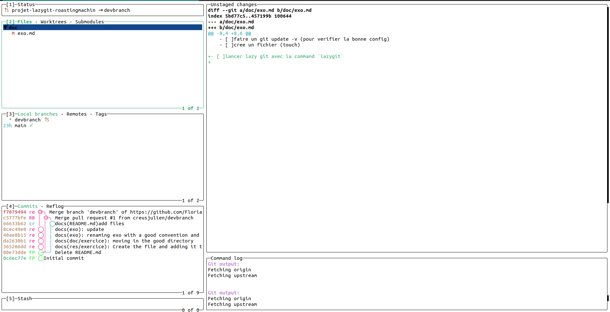

# 
Utilisation de LazyGit 101

Pour faire l'exercice, vous aurez besoin d'avoir installé LazyGit. Voici un lien pour [l'installer](../src/Install.md) 

  

- [ ] Les 4 étapes de création d'un repo
   - [ ] Créer le repo GitHub
   - [ ] Cloner le repo GitHub en local
   - [ ] Faire un `git remote -v`
   - [ ] Créer un fichier `toto`
- [ ] Écrire sur la ligne 1 du fichier `toto`
- [ ] Lancer LazyGit avec la commande `lazygit`. Vous devriez avoir ceci dans le terminal :

- [ ] Ajouter le fichier que vous venez de créer dans la staging
   - Le sélectionner : on peut naviguer avec les flèches ou en faisant des clics 
   - Utiliser le raccourci `espace` pour l'ajouter 

- [ ] Faire un commit avec comme message `doks: création d'un fichier` (oui la faute est voulue)
   - Le raccourci pour commit est `c`

- [ ] Faire un pull/push (les push et pull sont dirigés de base vers l'origine)
   - Le raccourci pour pull est `p`
   - Le raccourci pour push est `P`

- On va voir maintenant comment renommer un commit
   - [ ] Sélectionner le commit dans l'onglet et utiliser le raccourci `r`
- [ ] Création d'une branche du nom de "testing"
   - `n`dans l'onglet 3
- Vous êtes à présent dans la branche testing [ ] , creér un fichier peu importe le nom
- [ ] Modifier la ligne 1 du fichier toto
- [ ] Nous allons maintenant merge les 2 branches
   - dans l'onglet 3 `M` sur `testing` en ayant checkout la main avec `espace` 
- Pour gérer les conflits utilisés vscode ou pour ceux qui ont installer _Vim_ vous pouvez utiliser le raccourci `e` dans __lazygit__

- [ ] Pour ceux qui veulent personnaliser lazygit, nous vous proposons ce [fichier](../res/exemple-de-config.yml) comme base à remplacer dans le chemin ci-dessous : `~/.config/lazygit/config.yml`. Si vous souhaitez ajouter des commandes supplémentaires, voici le [lien](https://github.com/jesseduffield/lazygit/wiki/Custom-Commands-Compendium#pushing-to-a-specific-remote-repository).
- Les différentes commandes sont :
   - `f1` pour effectuer un pull en choisissant la branche et le remote.
   - `f2` pour choisir le remote pour le push.
   - `ctrl-v` pour effectuer un commit conventionnel.
