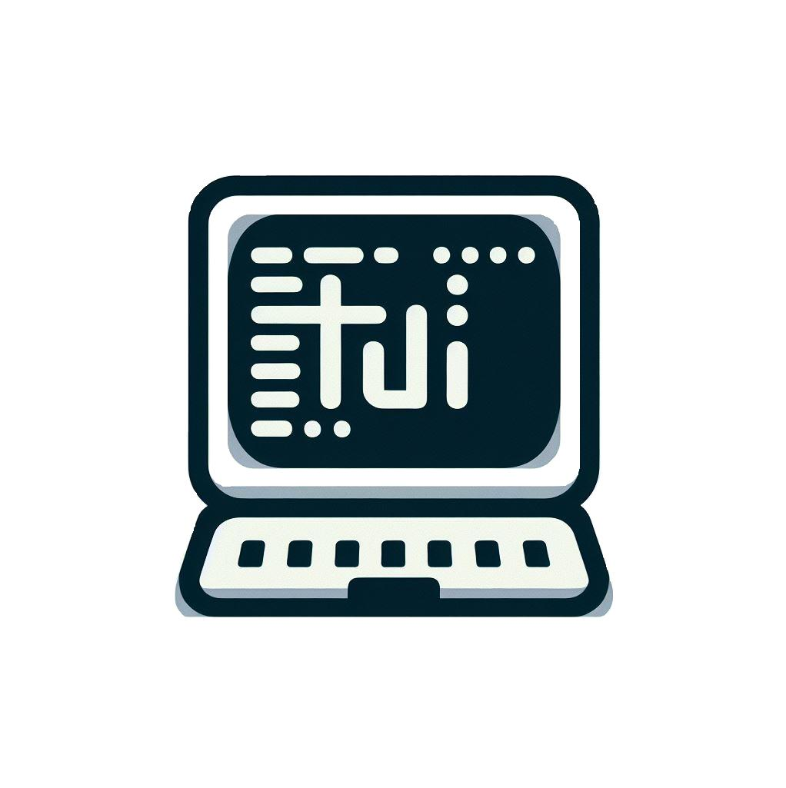

  

  
<h1 align="center">LazygitProject</h1>

# Terminal TUI :computer:

Un environnement en mode texte (`TUI`, de l'anglais « Text User Interface », « Textual User Interface » ou encore «Terminal User Interface ») est un rétronyme introduit dans le jargon informatique après l'invention des environnements graphiques pour se distinguer des interfaces en ligne de commande. Ce type d'interface utilisateur occupe la totalité de l'écran comme les interfaces graphiques, et n'est donc pas limité au traitement ligne par ligne comme les `CLI`.

Ce type d'environnement s'avère très utile pour le développement d'applications sans besoins graphiques.

De nombreuses bibliothèques logicielles permettent le développement de telles interfaces utilisateur, sur différentes plates-formes.